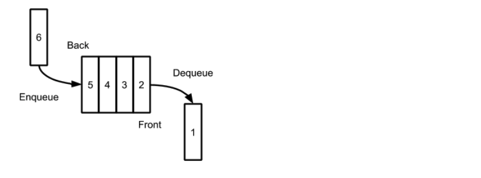
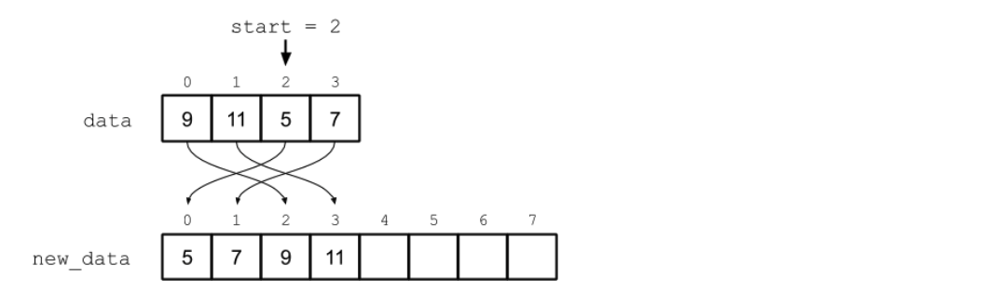

# Queues (first in, first out (or FIFO))

- Add and remove at both ends. (I.e. Add from end and remove from front.)

## Queue Operations

- A queue is a data structure that imposes a **first in, first out (or FIFO)** ordering on the elements it stores.

- Unlike a stack, the first element to be removed from a queue is the first one that was placed into it. 

- The queue ADT specifies an abstract structure with two ends: a front and a back. Every time a new element is inserted into the queue, it is inserted at the back, and every time an element is removed from the queue, it is removed from the front.

### `enqueue(x)`

- Add $x$ to the back of the queue. This item now represents the back of the queue.

### `dequeue()`

- Remove the first item in the queue and returns its value. The item behind it is now at the front of the queue. 

## Implementing a Queue Using a Linked List

e.g.

`                            tail`

`                            |`

`head -> 1 next -> 3 next -> 5 next -> None`

front is 1

end is 5

`enqueue(7) # Add 7`

`                                      tail`

`                                      |`

`head -> 1 next -> 3 next -> 5 next -> 7 next -> None`

front is 1

end is 7

`dequeue() # Remove 1` 

`head -> 3 next -> 5 next -> 7 next -> None`

front is 3

end is 7

`dequeue() # Remove 3`

`head -> 5 next -> 7 next -> None`

front is 5

end is 7

## Implementing a Queue Using a Dynamic Array

- If we remove the first item from the underlying array when we dequeue, we will need to shift each remaining item forward. However, this would mean that each dequeue operation will have $\mathcal{O}(n)$ runtime complexity, which is undesirable.

### wraparound via circular buffer

- Instead, we’ll allow the values to wrap around back to the beginning of the array. (i.e. "wraparound")

- An array like this, in which we allow data to wrap around from the back to the front, is known as a **circular buffer**.  
### Resizing

- When we resize our queue’s underlying physical array, we will take the opportunity to reindex the array so that the start of the queue once again corresponds to the physical index 0. 

- To do this, we loop through the incumbent array beginning at the start index (using the increment logic described above), while copying values to the new array starting at index 0.

