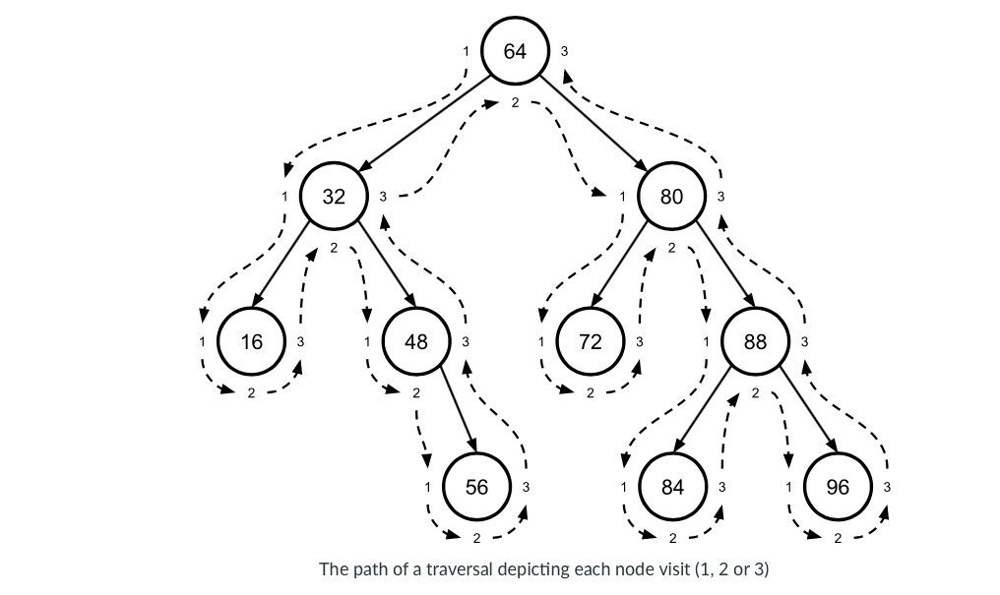

# Binary Trees

## Introduction

- A binary tree is a special type of tree in which each node can have at most two children (i.e. left and right child).


## Types/States of Binary Trees

- A **full binary tree** is a binary tree in which every node has exactly two child nodes or zero child nodes (i.e. a leaf). 

- A **perfect binary tree** is a full binary tree (i.e., one where all interior nodes have two children) where all the leaves are at the same depth. 

If we know a **perfect binary tree** has height $h$, then we know: 

- $2^h$ leaves

- $2^{h+1} - 1$ nodes

If we know that a **perfect binary tree** has $n$ nodes, then we know its height is approximately $\log(n)$. 

- A **complete binary tree** is a binary tree that is perfect except for the deepest level, where all the nodes are all as far left as possible. 


## Binary Search Trees

- A binary search tree (or BST), then, is a binary tree that satisfies the following property (known as the “binary search tree property”): Within a binary search tree, the key of each node N is greater than all the keys in N’s left subtree and less than or equal to all the keys in N’s right subtree.

- Note that there is no restriction on the shape of a BST. A BST does not have to be full, perfect, complete, etc. 


## Traversals

There are two high-level types of tree traversal:

**Depth-first** 

- A depth-first traversal moves as far downward in the tree as it can go before moving across in the tree.

**Breadth-first** 

- A breadth-first traversal moves as far across the tree as it can go before moving down in the tree. 

## Depth First Traversal


**Preorder traversal** 

- NLR – process the current node before traversing either of its subtrees

**Inorder traversal**

- LNR – traverse the current node’s left subtree before processing the node itself, and then traverse the node’s right subtree

- sorted order 

- most common 

**Postorder traversal** 

- LRN – traverse both of the current node’s subtrees (left, then right) before processing the node itself

e.g. 



Preorder traversal (node first, left and right)

`64 32 16 48 56 80 72 88 84 96`

Inorder traversal (left first, node, and right)


`16 32 48 56 64 72 80 84 88 96`

Post order traversal (left first, right, and node)

`16 56 48 32 72 84 96 88 80 64`

e.g. 

```{}
inOrder(n):
    if n is not NULL:
        inOrder(n.left)
        process n
        inOrder(n.right)
```

## Breadth First Search

Level-order traversal 

`64 32 80 16 48 72 88 56 84 96`


e.g. (werid!)

```{}
levelOrder(bst):
    q ← new, empty queue
    enqueue(q, bst.root)
    while q is not empty:
        n ← dequeue(q)
        if n is not NULL:
            process n
            enqueue(q, n.left)
            enqueue(q, n.right)
```

