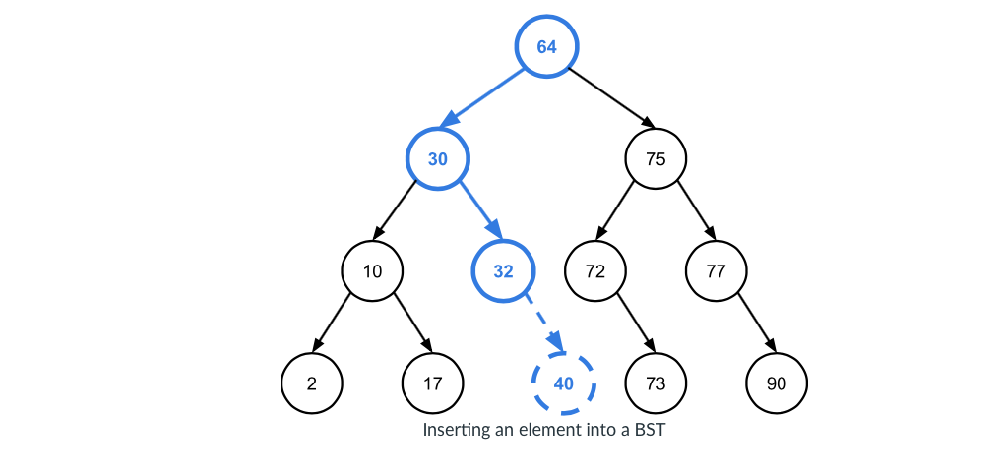
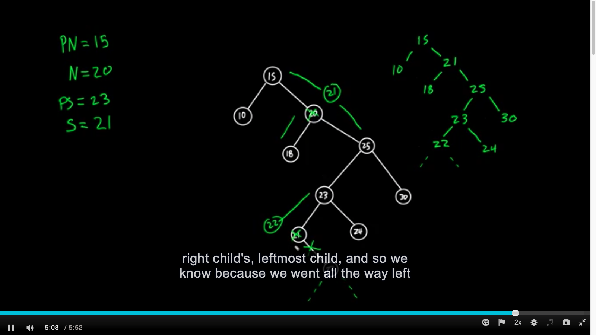

# BST Operations

## Introduction

- Some of the core BST operations: finding an element, inserting a new element, and removing an element. 

- A given node does not have a subtree on either the left or right side, the node’s child on that side will be `None`. A leaf node in a BST has `None` for both the left and right children. 

## Finding an element in a BST

e.g. 

```{}
find(bst, kq):
	n ← bst.root            # Iterate using root node 
	while n is not None:
		if n.key equals kq:
			return success
		else if kq < n.key:   # If value < current node's key 
			n ← n.left          # Move to current's left child. 
		else:                 # If value > current node's key 
			n ← n.right         # Move to current's right child.
	return failure
```


## Inserting a new element into a BST

- New elements (distinct or duplicate) are always inserted into a BST as leaves. This avoids restructure. 

- The new node will become the child of the `None` node's parent. 

e.g. 

```{}
insert(bst, k, v):
	p ← None               # Keep track of the location of the new node’s parent
	n ← bst.root           # Iterate
	while n is not None:
		p ← n
		if k < n.key:
			n ← n.left
		else:
			n ← n.right
	create a new node as the child of p containing k, v
```



Insert 40, for example 

1. 64 -> 30 -> 32 

2. 32's right child was None 

3. Add 40 to 32's right child

## Removing an element from a BST

- May need to restructure. Can be difficult. 

- To understand what a node’s inorder successor is, it’s helpful to just imagine all of the elements stored in the tree lined up in ascending order by key. For example, in the BST depicted above, the order (of the keys) would look like this:

`2 10 17 30 32 64 72 73 75 77 90`

Remove 64 

1. Find 64's inorder successor $s$, which is 72, since 72 comes after 64. 

**A node n’s inorder successor is always the leftmost node in n’s right subtree.** 

2. Keep track of $n$’s parent node $pn$, which is root pointer in this case since 64 is root node. 

3. Keep track of $s$’s parent node $ps$, which is 75. 

4. Update pointers to give $n$’s children to $s$ and remove $n$ from the tree: 

$n$’s left child becomes $s$’s left child.

$s$’s right child (which might be `None`) becomes $ps$’s left child.

$n$’s right child becomes $s$’s right child.

e.g. 

```{}
remove(bst, k):
	n, pn ← find the node to be removed and its parent
			based on key k, as in the find() function
	if n has no children:
		update pn to point to None instead of n
	else if n has only 1 child:
		update pn to point to n’s child instead of n
	else:
		s, ps ← find n’s inorder successor and its
				parent, as described above
		s.left ← n.left
		if s is not n.right: 
			ps.left ← s.right
			s.right ← n.right
		update pn to point to s instead of n
	free n
```

e.g. 



Remove 20 $n = 20$

1. Move 21 up $s = 21$

2. 18 becomes 21's left child 

3. 25 becomes 21's right child

4. Move 22 to 23's left 


## The runtime complexities of BST operations

- The total amount of work done searching in all three of these operations is $\mathcal{O}(h)$, where $h$, again, is the height of the tree.

- Each of these three operations (`find`, `insert`, and `remove`) has a runtime complexity of $\mathcal{O}(h)$.

- Explore strategies for limiting the height of a BST to be close to $\log(n)$, which will improve the runtimes of the main BST operations to $\mathcal{O}(\log(n))$ later.

