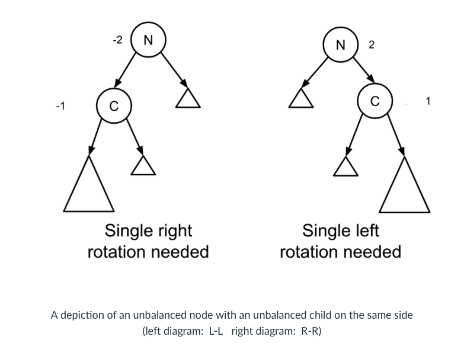
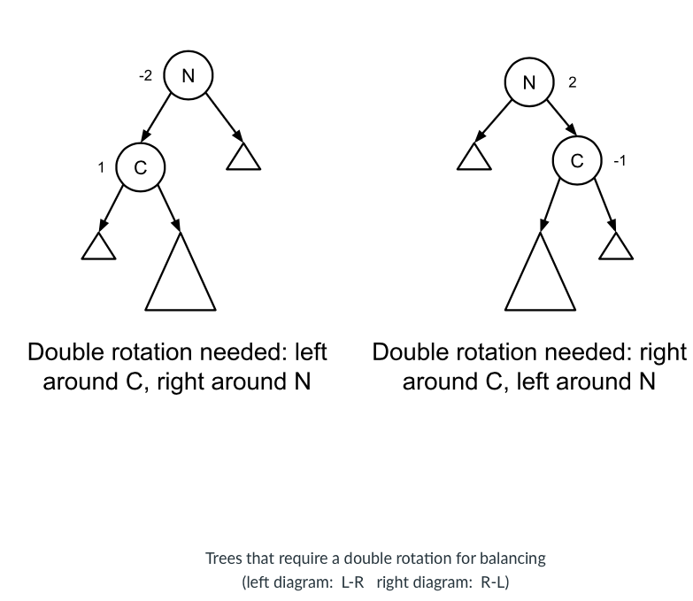
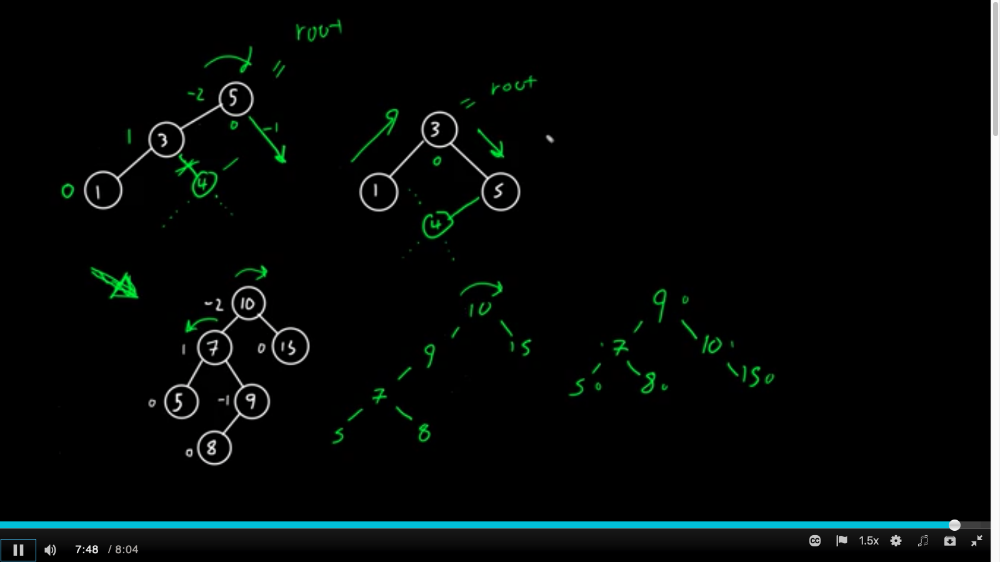

# AVL Tree Rotations

## Introduction

## Rotations

## Determining the Rotations Needed

- If N has a balance factor of $–2$, this means N is left-heavy. If N has a balance factor of $2$, this means N is right-heavy. 

- Refer to the *heavier* of N’s children as C. 

- If C has a balance factor of $–1$, this means C is left-heavy. If C has a balance factor of $1$, this means C is right-heavy.

Four cases to handle

| cases | do | confirm? |
| ------------- | ------------- | ------------- |
| L-L | single rotation (right) | (-2, -1) |
| R-R | single rotation (left) | (2, 1) |
| L-R | double rotation (left, then right) | (-2, 1) |
| R-L | double rotation (right, then left)  | (2, -1) |

Single rotation

- If N and C are heavy in the same direction (i.e., if the balance factor has the same sign at both N and C), then a single rotation is needed around N in the opposite direction as N’s heaviness. 

Double rotation

- In a double rotation, we rotate twice. 

- If N is left-heavy and C is right-heavy (i.e., N has a negative balance factor and C has a positive balance factor) then we first rotate left around C then right around N. This is also known as an L-R case. 

-  If N is right-heavy and C is left-heavy (i.e., N has a positive balance factor and C has a negative balance factor) then we first rotate right around C then left around N. This is also known as an R-L case. 

- Edge case: root node 

