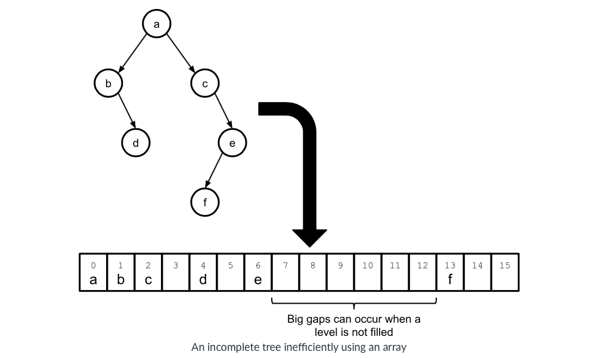
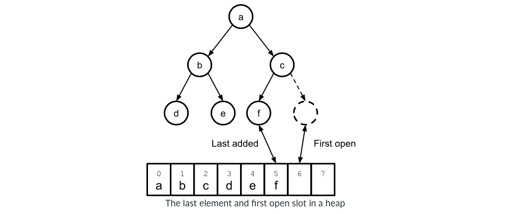

# Introduction

# Overview

- Root node of the heap is stored at index 0.

- Left and right children of a node at index $i$ are stored at indices $2 * i + 1$ and $2 * i + 2$, respectively.

- Parent of a node at index $i$ is stored at $(i − 1) / 2$ (using floor). 

- If the binary tree was not complete, it would leave gaps in the array. (The complete binary tree would leave no gaps in the array.)

- Keeping track of the last element and the first open spot in this array representation of the heap is simple. 

# Inserting Into A Heap

 
