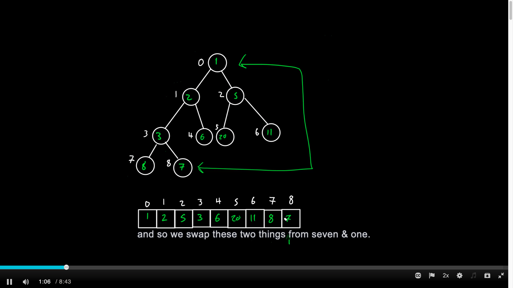
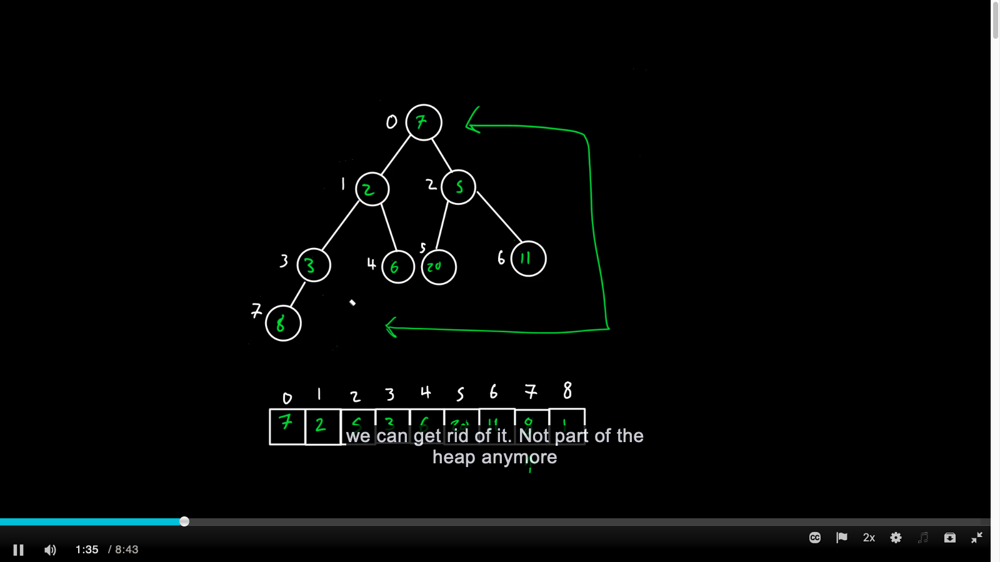
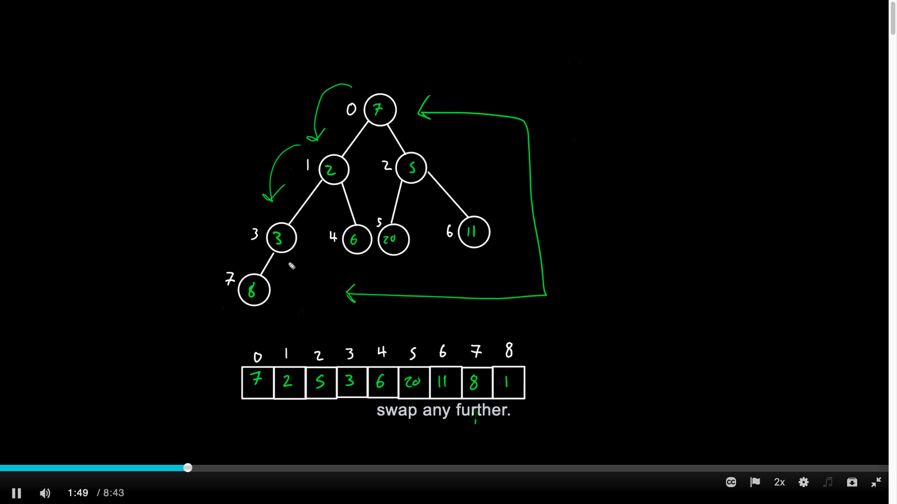
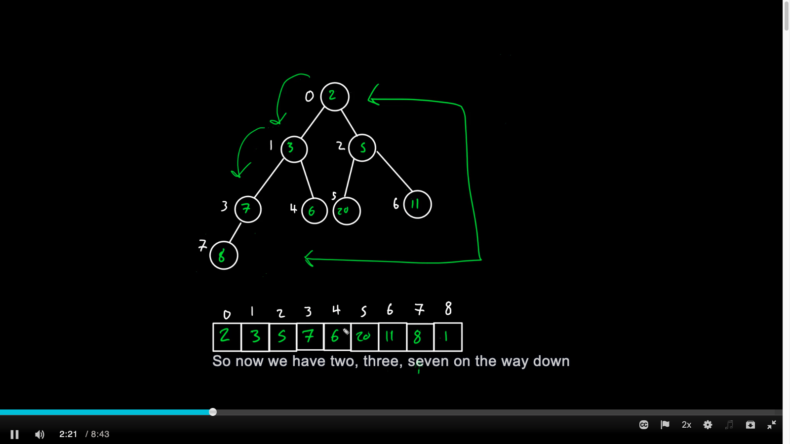
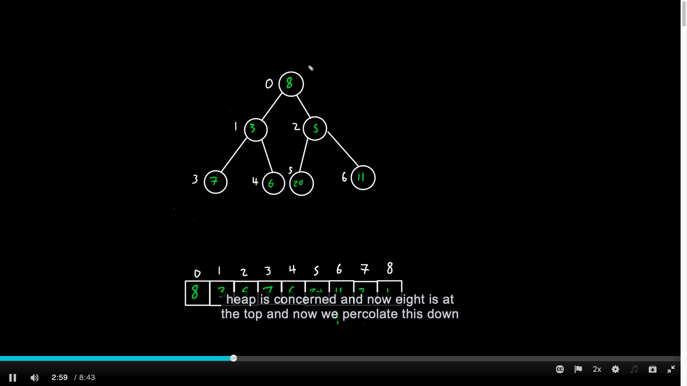
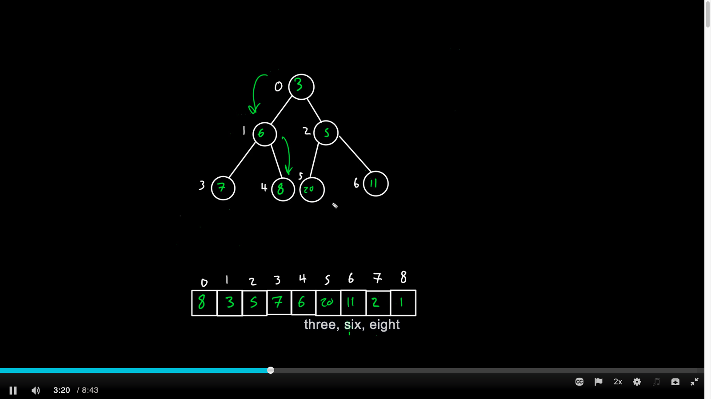
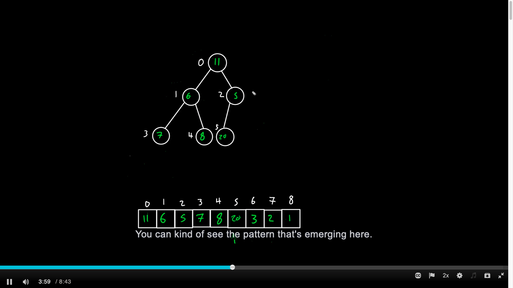

# Introduction

# Overview

- Root node of the heap is stored at index 0.

- Left and right children of a node at index $i$ are stored at indices $2 * i + 1$ and $2 * i + 2$, respectively.

- Parent of a node at index $i$ is stored at $(i − 1) / 2$ (using floor). 

- If the binary tree was not complete, it would leave gaps in the array. (The complete binary tree would leave no gaps in the array.)

- Keeping track of the last element and the first open spot in this array representation of the heap is simple. 

# Inserting Into A Heap (Using "precolate up")

Inserting an element into the array representation of a heap follows this procedure: 

1. Put the new element at the end of the array.

2. Compute the inserted element’s parent index, $(i − 1) / 2$. 

3. Compare the value of the inserted element with the value of its parent.

4. If the value of the parent is greater than the value of the inserted element, swap the elements in the array and repeat from step 2. 

    1. Do not repeat if the element has reached the beginning of the array.

# Removing From A Heap (Using "precolate down")

Removing the minimum element is slightly more involved. It follows this procedure:

1. Remember the value of the first element in the array (to be returned later).

2. Replace the value of the first element in the array with the value of the last element, and remove the last element.

3. If the array is not empty (i.e., it started with more than one element), compute the indices of the children of the replacement element ($2 * i + 1$ and $2 * i + 2$). 

    1. If both of these elements fall beyond the bounds of the array, we can stop here.

4. Compare the value of the replacement element with the minimum value of its two children (or possibly one child).

5. If the replacement element’s value is greater than its minimum child’s value, swap those two elements in the array, and repeat from step 3.

# Building a Heap From an Unsorted Array (Using "precolate down")

$\mathcalO(n)$

- We can use a procedure similar to the downward percolation (precolate down) part of our removal method to build a heap from an arbitrary array of values.

- If we percolate down the first non-leaf element, then the subtree rooted at that element’s original position will be a proper heap.

- The first non-leaf element (from the back of the array) is at $n / 2 − 1$ (using the floor from integer division). 

- We can repeat this, moving backwards one element at a time from the first non-leaf element, and each time we percolate an element down, the subtree rooted at that element’s original position will be a proper heap. 

# Heapsort

$\mathcalO(n log n)$ 

