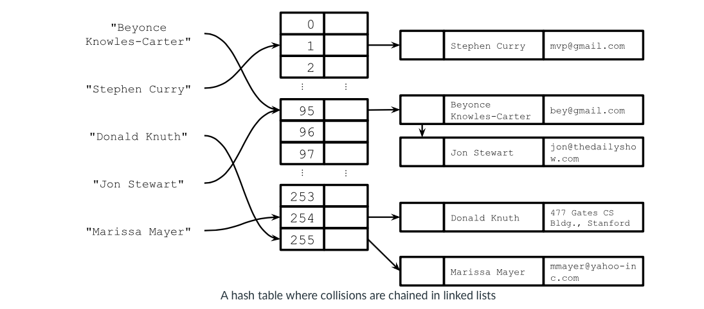
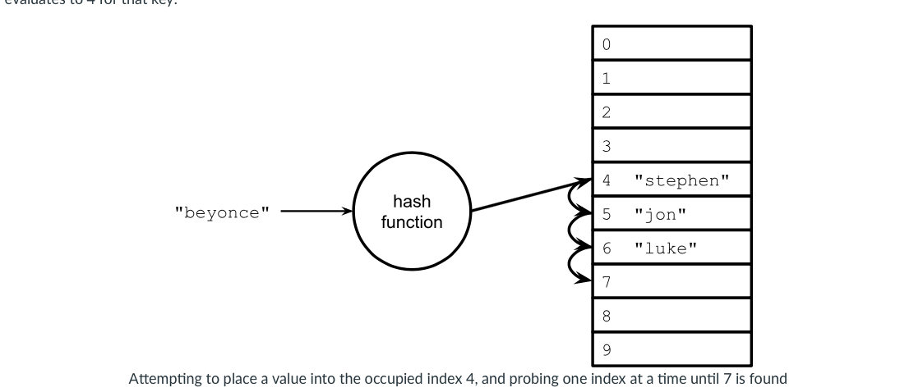

# Hash Table Collisions

## Introduction

- Sometimes, hash functions will generate the same output for two different inputs. This is called a collision. 

- There are two ways to accommodate. 

  1. via chaining (use linked lists as buckets or chains)

  2. via open addressing (store directly in hash table array)

## Collision resolution with chaining

- The linked lists are commonly referred to as buckets or chains, and this technique of collision resolution is known as chaining. 

## Collision resolution with open addressing

- The procedure for inserting an element in an open addressing-based hash table looks like this: 

- This process of searching for an empty position is called probing. There are many different probing schemes:

## Complexity Analysis of Open Address Hashing

