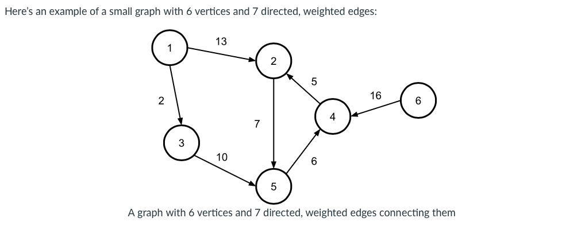
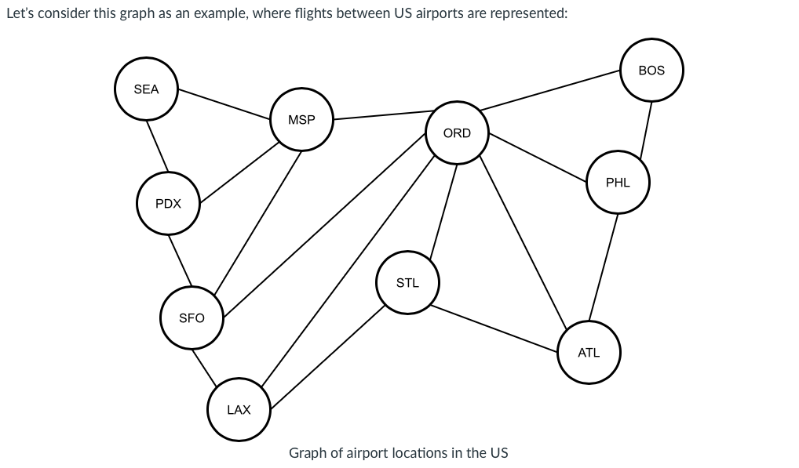
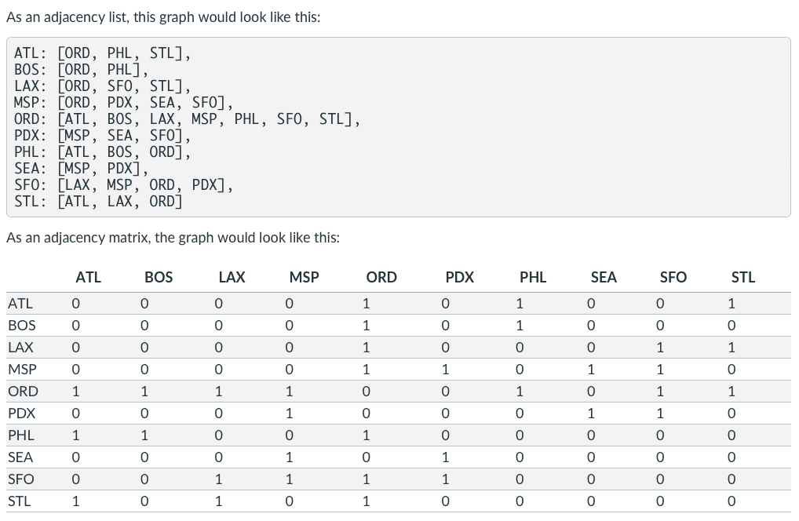
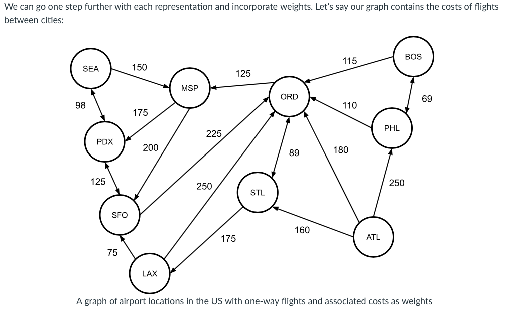
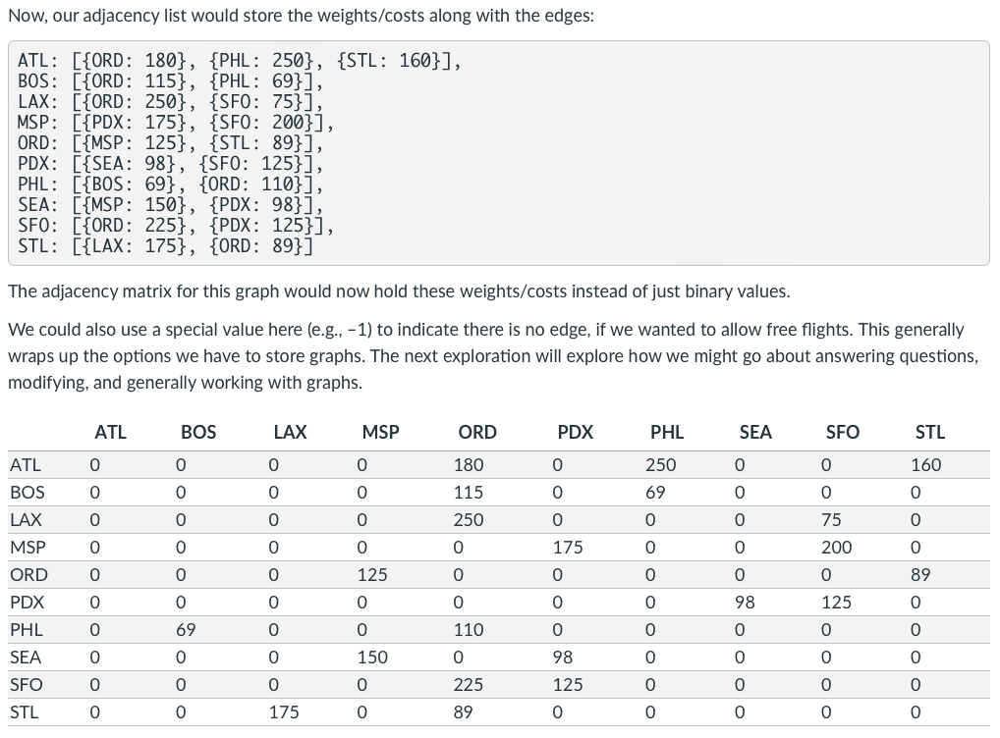

# Graphs

## Introduction

- Graphs are ubiquitous in computer science:

Social networks, like Facebook or Twitter
Computer graphics
Machine learning
Computer vision
Logistics and optimization
Computer networking

- Graphs are made up of vertices, representing elements in the graph, and edges, representing the connections between those elements. 

## Graph Components

- Vertices represent objects, states (i.e. conditions or configurations), locations, etc. 

- Edges represent relationships or connections between vertices.

  - Edges are represented as vertex pairs: the set of edges $E = \{(v_i, v_j),...\}$. 
  
  - Edges can be directed or undirected. 

  - If there is an edge between $v_i$ and $v_j$, then $v_i$ and $v_j$ are said to be adjacent (or they are neighbors).
  
  - Edges can be weighted or unweighted. (Weighted edges represent a property of the edge. For example, it might represent the distance between vertices).

- Graphs represent general relationships between objects. 

  - connected, strongly connected: 

  - paths: 
  
  - simple path: 
  
  - 

- There are many questions we may want to ask about a graph:

  - Is node X in the graph?
  
  - Is node Y reachable from node X?
  
  - Which nodes are reachable from node X?
  
  - Are X and Y adjacent nodes?
  
  - What is the shortest path from node X to node Y?
  
  - How many edges are there between node A and node Y?
  
  - How many connected components are there in the graph?

## Representing Graphs

- There are two main ways to represent a graph in practice:

  - As an adjacency list, in which each vertex stores a list of its adjacent vertices.
  
  - As an adjacency matrix, which is a two-dimensional matrix whose rows and columns represent vertices. If there is an edge between $v_i$ and $v_j$, the value at location $(i, j)$ in the matrix will be non-zero.
  
Example: 

Example: 

